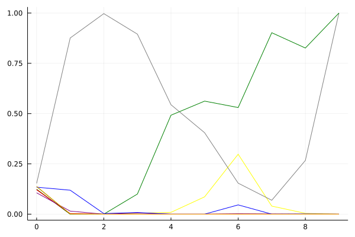
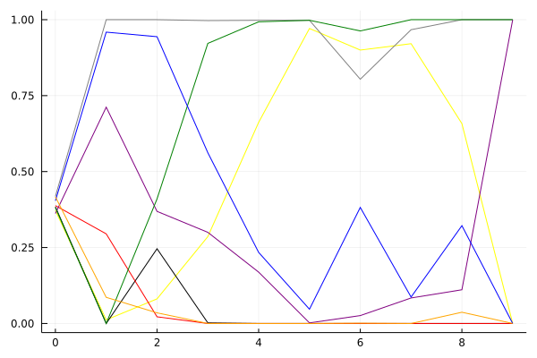

개인전 - KRPL 2021 시즌 1

## 시뮬레이션

### 1st 확률

x축: 트랙, y축: 확률
1번: 옐로우, 2번: 블랙, 3번: 레드, 4번: 화이트(회색), 5번: 퍼플, 6번: 그린, 7번: 블루, 8번: 오렌지

| 트랙 | JGWON | CHOICE | EAGLE | SSEAL | WINKLE | JUST | RUNPILMO | ROXY |
|:---|---:|---:|---:|---:|---:|---:|---:|---:|
| 초기 | 0.124 | 0.123 | 0.121 | 0.153 | 0.106 | 0.137 | 0.134 | 0.138 |
| 월드 뉴욕 대질주 | 0.000 | 0.000 | 0.003 | 0.876 | 0.015 | 0.000 | 0.119 | 0.001 |
| 황금문명 비밀장치의 위협 | 0.000 | 0.000 | 0.000 | 0.997 | 0.000 | 0.000 | 0.003 | 0.000 |
| 해적 숨겨진 보물 | 0.005 | 0.000 | 0.000 | 0.895 | 0.006 | 0.100 | 0.008 | 0.000 |
| WKC 브라질 서킷 | 0.009 | 0.000 | 0.000 | 0.544 | 0.000 | 0.492 | 0.000 | 0.000 |
| 월드 두바이 다운타운 | 0.086 | 0.000 | 0.000 | 0.405 | 0.000 | 0.562 | 0.000 | 0.000 |
| 빌리지 붐힐터널 | 0.298 | 0.000 | 0.000 | 0.154 | 0.002 | 0.530 | 0.046 | 0.000 |
| 차이나 골목길 대질주 | 0.040 | 0.000 | 0.000 | 0.069 | 0.001 | 0.902 | 0.000 | 0.000 |
| 님프 바다 신전의 비밀 | 0.004 | 0.000 | 0.000 | 0.267 | 0.000 | 0.826 | 0.001 | 0.000 |
| 노르테유 익스프레스 | 0.000 | 0.000 | 0.000 | 1.000 | 0.000 | 1.000 | 0.000 | 0.000 |

### Advance 확률

x축: 트랙, y축: 확률
1번: 옐로우, 2번: 블랙, 3번: 레드, 4번: 화이트(회색), 5번: 퍼플, 6번: 그린, 7번: 블루, 8번: 오렌지

| 트랙 | JGWON | CHOICE | EAGLE | SSEAL | WINKLE | JUST | RUNPILMO | ROXY |
|:---|---:|---:|---:|---:|---:|---:|---:|---:|
| 초기 | 0.372 | 0.384 | 0.388 | 0.418 | 0.362 | 0.381 | 0.404 | 0.417 |
| 월드 뉴욕 대질주 | 0.012 | 0.000 | 0.295 | 1.000 | 0.712 | 0.000 | 0.959 | 0.086 |
| 황금문명 비밀장치의 위협 | 0.081 | 0.246 | 0.022 | 1.000 | 0.369 | 0.410 | 0.944 | 0.035 |
| 해적 숨겨진 보물 | 0.286 | 0.002 | 0.000 | 0.997 | 0.300 | 0.922 | 0.562 | 0.000 |
| WKC 브라질 서킷 | 0.662 | 0.000 | 0.000 | 0.998 | 0.169 | 0.993 | 0.234 | 0.000 |
| 월드 두바이 다운타운 | 0.971 | 0.000 | 0.000 | 0.998 | 0.002 | 0.998 | 0.047 | 0.000 |
| 빌리지 붐힐터널 | 0.900 | 0.000 | 0.000 | 0.804 | 0.026 | 0.963 | 0.382 | 0.001 |
| 차이나 골목길 대질주 | 0.921 | 0.000 | 0.000 | 0.967 | 0.084 | 1.000 | 0.087 | 0.000 |
| 님프 바다 신전의 비밀 | 0.658 | 0.000 | 0.000 | 1.000 | 0.111 | 1.000 | 0.322 | 0.037 |
| 노르테유 익스프레스 | 0.000 | 0.000 | 0.000 | 1.000 | 1.000 | 1.000 | 0.000 | 0.000 |

### Repechage 확률

x축: 트랙, y축: 확률
1번: 옐로우, 2번: 블랙, 3번: 레드, 4번: 화이트(회색), 5번: 퍼플, 6번: 그린, 7번: 블루, 8번: 오렌지

| 트랙 | JGWON | CHOICE | EAGLE | SSEAL | WINKLE | JUST | RUNPILMO | ROXY |
|:---|---:|---:|---:|---:|---:|---:|---:|---:|
| 초기 | 0.627 | 0.654 | 0.639 | 0.668 | 0.603 | 0.647 | 0.635 | 0.647 |
| 월드 뉴욕 대질주 | 0.285 | 0.056 | 0.950 | 1.000 | 0.987 | 0.008 | 1.000 | 0.775 |
| 황금문명 비밀장치의 위협 | 0.436 | 0.716 | 0.138 | 1.000 | 0.814 | 0.803 | 0.996 | 0.230 |
| 해적 숨겨진 보물 | 0.960 | 0.081 | 0.002 | 1.000 | 0.964 | 1.000 | 0.988 | 0.041 |
| WKC 브라질 서킷 | 1.000 | 0.002 | 0.001 | 1.000 | 0.995 | 1.000 | 0.994 | 0.016 |
| 월드 두바이 다운타운 | 1.000 | 0.000 | 0.001 | 1.000 | 0.998 | 1.000 | 1.000 | 0.002 |
| 빌리지 붐힐터널 | 1.000 | 0.000 | 0.000 | 1.000 | 0.921 | 1.000 | 0.999 | 0.106 |
| 차이나 골목길 대질주 | 1.000 | 0.000 | 0.000 | 1.000 | 0.988 | 1.000 | 0.991 | 0.028 |
| 님프 바다 신전의 비밀 | 0.995 | 0.000 | 0.000 | 1.000 | 0.751 | 1.000 | 0.972 | 0.397 |
| 노르테유 익스프레스 | 1.000 | 0.000 | 0.000 | 1.000 | 1.000 | 1.000 | 1.000 | 0.000 |

## 랭킹 변동

### [전체 랭킹](../singles-full)

| 순위 | 변동 | 이름 | 점수 | 변동 | mu | 변동 | sigma | 변동 |
|---:|---:|:---:|---:|---:|---:|---:|---:|---:|
| 1 / 8 | NaN | [JUST](../JUST) | 2826 | +2826 | 3478 | +478 | 217 | -783 |
| 2 / 8 | NaN | [SSEAL](../SSEAL) | 2739 | +2739 | 3384 | +384 | 215 | -785 |
| 3 / 8 | NaN | [WINKLE](../WINKLE) | 2667 | +2667 | 3277 | +277 | 203 | -797 |
| 4 / 8 | NaN | [RUNPILMO](../RUNPILMO) | 2584 | +2584 | 3189 | +189 | 202 | -798 |
| 5 / 8 | NaN | [JGWON](../JGWON) | 2458 | +2458 | 3077 | +77 | 206 | -794 |
| 6 / 8 | NaN | [ROXY](../ROXY) | 2406 | +2406 | 3026 | +26 | 207 | -793 |
| 7 / 8 | NaN | [EAGLE](../EAGLE) | 1726 | +1726 | 2379 | -621 | 218 | -782 |
| 8 / 8 | NaN | [CHOICE](../CHOICE) | 1607 | +1607 | 2271 | -729 | 221 | -779 |

### 시즌 랭킹

| 순위 | 이름 | 점수 | mu | sigma | 주행 | 8인전 1-2-Mid-Lo | 8인전 평균득점 | 8인전 표준편차 | 2인전 전적 |
|---:|:---:|---:|---:|---:|---:|:---:|---:|---:|:---:|
| 1 / 8 | [JUST](../JUST) | 2826 | 3478 | 217 | 9 | 33-22-22-22 | 5.78 | 4.06 | 0-0 |
| 2 / 8 | [SSEAL](../SSEAL) | 2739 | 3384 | 215 | 9 | 22-22-44-11 | 5.78 | 3.35 | 0-0 |
| 3 / 8 | [WINKLE](../WINKLE) | 2667 | 3277 | 203 | 9 | 11-11-56-22 | 4.56 | 2.83 | 0-0 |
| 4 / 8 | [RUNPILMO](../RUNPILMO) | 2584 | 3189 | 202 | 9 | 0-22-67-11 | 4.33 | 1.94 | 0-0 |
| 5 / 8 | [JGWON](../JGWON) | 2458 | 3077 | 206 | 9 | 11-22-33-33 | 3.89 | 3.52 | 0-0 |
| 6 / 8 | [ROXY](../ROXY) | 2406 | 3026 | 207 | 9 | 22-0-33-44 | 3.56 | 3.91 | 0-0 |
| 7 / 8 | [EAGLE](../EAGLE) | 1726 | 2379 | 218 | 9 | 0-0-33-67 | 0.78 | 1.99 | 0-0 |
| 8 / 8 | [CHOICE](../CHOICE) | 1607 | 2271 | 221 | 9 | 0-0-11-89 | 0.33 | 1.87 | 0-0 |

### 트랙 별 랭킹

#### [WKC 브라질 서킷](../brazil)

| 순위 | 변동 | 이름 | 점수 | 변동 | mu | 변동 | sigma | 변동 |
|:---:|:---:|:---:|---:|---:|---:|---:|---:|---:|
| 1 / 8 | NaN | [JUST](../JUST) | 2161 | +2161 | 4274 | +1274 | 704 | -296 |
| 2 / 8 | NaN | [JGWON](../JGWON) | 1887 | +1887 | 3763 | +763 | 625 | -375 |
| 3 / 8 | NaN | [SSEAL](../SSEAL) | 1622 | +1622 | 3423 | +423 | 600 | -400 |
| 4 / 8 | NaN | [WINKLE](../WINKLE) | 1363 | +1363 | 3137 | +137 | 591 | -409 |
| 5 / 8 | NaN | [RUNPILMO](../RUNPILMO) | 1090 | +1090 | 2863 | -137 | 591 | -409 |
| 6 / 8 | NaN | [ROXY](../ROXY) | 776 | +776 | 2577 | -423 | 600 | -400 |
| 7 / 8 | NaN | [EAGLE](../EAGLE) | 361 | +361 | 2237 | -763 | 625 | -375 |
| 8 / 8 | NaN | [CHOICE](../CHOICE) | -388 | -388 | 1726 | -1274 | 704 | -296 |

#### [노르테유 익스프레스](../noex)

| 순위 | 변동 | 이름 | 점수 | 변동 | mu | 변동 | sigma | 변동 |
|:---:|:---:|:---:|---:|---:|---:|---:|---:|---:|
| 1 / 8 | NaN | [WINKLE](../WINKLE) | 2161 | +2161 | 4274 | +1274 | 704 | -296 |
| 2 / 8 | NaN | [SSEAL](../SSEAL) | 1887 | +1887 | 3763 | +763 | 625 | -375 |
| 3 / 8 | NaN | [RUNPILMO](../RUNPILMO) | 1622 | +1622 | 3423 | +423 | 600 | -400 |
| 4 / 8 | NaN | [JUST](../JUST) | 1363 | +1363 | 3137 | +137 | 591 | -409 |
| 5 / 8 | NaN | [ROXY](../ROXY) | 1090 | +1090 | 2863 | -137 | 591 | -409 |
| 6 / 8 | NaN | [CHOICE](../CHOICE) | 776 | +776 | 2577 | -423 | 600 | -400 |
| 7 / 8 | NaN | [EAGLE](../EAGLE) | 361 | +361 | 2237 | -763 | 625 | -375 |
| 8 / 8 | NaN | [JGWON](../JGWON) | -388 | -388 | 1726 | -1274 | 704 | -296 |

#### [님프 바다 신전의 비밀](../nymph)

| 순위 | 변동 | 이름 | 점수 | 변동 | mu | 변동 | sigma | 변동 |
|:---:|:---:|:---:|---:|---:|---:|---:|---:|---:|
| 1 / 8 | NaN | [ROXY](../ROXY) | 2161 | +2161 | 4274 | +1274 | 704 | -296 |
| 2 / 8 | NaN | [SSEAL](../SSEAL) | 1887 | +1887 | 3763 | +763 | 625 | -375 |
| 3 / 8 | NaN | [RUNPILMO](../RUNPILMO) | 1622 | +1622 | 3423 | +423 | 600 | -400 |
| 4 / 8 | NaN | [JUST](../JUST) | 1363 | +1363 | 3137 | +137 | 591 | -409 |
| 5 / 8 | NaN | [WINKLE](../WINKLE) | 1090 | +1090 | 2863 | -137 | 591 | -409 |
| 6 / 8 | NaN | [JGWON](../JGWON) | 776 | +776 | 2577 | -423 | 600 | -400 |
| 7 / 8 | NaN | [EAGLE](../EAGLE) | 361 | +361 | 2237 | -763 | 625 | -375 |
| 8 / 8 | NaN | [CHOICE](../CHOICE) | -388 | -388 | 1726 | -1274 | 704 | -296 |

#### [빌리지 붐힐터널](../boomhill)

| 순위 | 변동 | 이름 | 점수 | 변동 | mu | 변동 | sigma | 변동 |
|:---:|:---:|:---:|---:|---:|---:|---:|---:|---:|
| 1 / 8 | NaN | [ROXY](../ROXY) | 2161 | +2161 | 4274 | +1274 | 704 | -296 |
| 2 / 8 | NaN | [RUNPILMO](../RUNPILMO) | 1887 | +1887 | 3763 | +763 | 625 | -375 |
| 3 / 8 | NaN | [WINKLE](../WINKLE) | 1622 | +1622 | 3423 | +423 | 600 | -400 |
| 4 / 8 | NaN | [JGWON](../JGWON) | 1363 | +1363 | 3137 | +137 | 591 | -409 |
| 5 / 8 | NaN | [EAGLE](../EAGLE) | 1090 | +1090 | 2863 | -137 | 591 | -409 |
| 6 / 8 | NaN | [JUST](../JUST) | 776 | +776 | 2577 | -423 | 600 | -400 |
| 7 / 8 | NaN | [CHOICE](../CHOICE) | 361 | +361 | 2237 | -763 | 625 | -375 |
| 8 / 8 | NaN | [SSEAL](../SSEAL) | -388 | -388 | 1726 | -1274 | 704 | -296 |

#### [월드 뉴욕 대질주](../newyork)

| 순위 | 변동 | 이름 | 점수 | 변동 | mu | 변동 | sigma | 변동 |
|:---:|:---:|:---:|---:|---:|---:|---:|---:|---:|
| 1 / 8 | NaN | [SSEAL](../SSEAL) | 2161 | +2161 | 4274 | +1274 | 704 | -296 |
| 2 / 8 | NaN | [RUNPILMO](../RUNPILMO) | 1887 | +1887 | 3763 | +763 | 625 | -375 |
| 3 / 8 | NaN | [WINKLE](../WINKLE) | 1622 | +1622 | 3423 | +423 | 600 | -400 |
| 4 / 8 | NaN | [EAGLE](../EAGLE) | 1363 | +1363 | 3137 | +137 | 591 | -409 |
| 5 / 8 | NaN | [ROXY](../ROXY) | 1090 | +1090 | 2863 | -137 | 591 | -409 |
| 6 / 8 | NaN | [JGWON](../JGWON) | 776 | +776 | 2577 | -423 | 600 | -400 |
| 7 / 8 | NaN | [CHOICE](../CHOICE) | 361 | +361 | 2237 | -763 | 625 | -375 |
| 8 / 8 | NaN | [JUST](../JUST) | -388 | -388 | 1726 | -1274 | 704 | -296 |

#### [월드 두바이 다운타운](../dubai)

| 순위 | 변동 | 이름 | 점수 | 변동 | mu | 변동 | sigma | 변동 |
|:---:|:---:|:---:|---:|---:|---:|---:|---:|---:|
| 1 / 8 | NaN | [JGWON](../JGWON) | 2161 | +2161 | 4274 | +1274 | 704 | -296 |
| 2 / 8 | NaN | [JUST](../JUST) | 1887 | +1887 | 3763 | +763 | 625 | -375 |
| 3 / 8 | NaN | [SSEAL](../SSEAL) | 1622 | +1622 | 3423 | +423 | 600 | -400 |
| 4 / 8 | NaN | [RUNPILMO](../RUNPILMO) | 1363 | +1363 | 3137 | +137 | 591 | -409 |
| 5 / 8 | NaN | [EAGLE](../EAGLE) | 1090 | +1090 | 2863 | -137 | 591 | -409 |
| 6 / 8 | NaN | [WINKLE](../WINKLE) | 776 | +776 | 2577 | -423 | 600 | -400 |
| 7 / 8 | NaN | [ROXY](../ROXY) | 361 | +361 | 2237 | -763 | 625 | -375 |
| 8 / 8 | NaN | [CHOICE](../CHOICE) | -388 | -388 | 1726 | -1274 | 704 | -296 |

#### [차이나 골목길 대질주](../golmokgil)

| 순위 | 변동 | 이름 | 점수 | 변동 | mu | 변동 | sigma | 변동 |
|:---:|:---:|:---:|---:|---:|---:|---:|---:|---:|
| 1 / 8 | NaN | [JUST](../JUST) | 2161 | +2161 | 4274 | +1274 | 704 | -296 |
| 2 / 8 | NaN | [WINKLE](../WINKLE) | 1887 | +1887 | 3763 | +763 | 625 | -375 |
| 3 / 8 | NaN | [SSEAL](../SSEAL) | 1622 | +1622 | 3423 | +423 | 600 | -400 |
| 4 / 8 | NaN | [ROXY](../ROXY) | 1363 | +1363 | 3137 | +137 | 591 | -409 |
| 5 / 8 | NaN | [JGWON](../JGWON) | 1090 | +1090 | 2863 | -137 | 591 | -409 |
| 6 / 8 | NaN | [RUNPILMO](../RUNPILMO) | 776 | +776 | 2577 | -423 | 600 | -400 |
| 7 / 8 | NaN | [CHOICE](../CHOICE) | 361 | +361 | 2237 | -763 | 625 | -375 |
| 8 / 8 | NaN | [EAGLE](../EAGLE) | -388 | -388 | 1726 | -1274 | 704 | -296 |

#### [해적 숨겨진 보물](../haesumbo)

| 순위 | 변동 | 이름 | 점수 | 변동 | mu | 변동 | sigma | 변동 |
|:---:|:---:|:---:|---:|---:|---:|---:|---:|---:|
| 1 / 8 | NaN | [JUST](../JUST) | 2161 | +2161 | 4274 | +1274 | 704 | -296 |
| 2 / 8 | NaN | [JGWON](../JGWON) | 1887 | +1887 | 3763 | +763 | 625 | -375 |
| 3 / 8 | NaN | [WINKLE](../WINKLE) | 1622 | +1622 | 3423 | +423 | 600 | -400 |
| 4 / 8 | NaN | [SSEAL](../SSEAL) | 1363 | +1363 | 3137 | +137 | 591 | -409 |
| 5 / 8 | NaN | [RUNPILMO](../RUNPILMO) | 1090 | +1090 | 2863 | -137 | 591 | -409 |
| 6 / 8 | NaN | [ROXY](../ROXY) | 776 | +776 | 2577 | -423 | 600 | -400 |
| 7 / 8 | NaN | [CHOICE](../CHOICE) | 361 | +361 | 2237 | -763 | 625 | -375 |
| 8 / 8 | NaN | [EAGLE](../EAGLE) | -388 | -388 | 1726 | -1274 | 704 | -296 |

#### [황금문명 비밀장치의 위협](../jangchi)

| 순위 | 변동 | 이름 | 점수 | 변동 | mu | 변동 | sigma | 변동 |
|:---:|:---:|:---:|---:|---:|---:|---:|---:|---:|
| 1 / 8 | NaN | [SSEAL](../SSEAL) | 2161 | +2161 | 4274 | +1274 | 704 | -296 |
| 2 / 8 | NaN | [JUST](../JUST) | 1887 | +1887 | 3763 | +763 | 625 | -375 |
| 3 / 8 | NaN | [CHOICE](../CHOICE) | 1622 | +1622 | 3423 | +423 | 600 | -400 |
| 4 / 8 | NaN | [RUNPILMO](../RUNPILMO) | 1363 | +1363 | 3137 | +137 | 591 | -409 |
| 5 / 8 | NaN | [JGWON](../JGWON) | 1090 | +1090 | 2863 | -137 | 591 | -409 |
| 6 / 8 | NaN | [WINKLE](../WINKLE) | 776 | +776 | 2577 | -423 | 600 | -400 |
| 7 / 8 | NaN | [ROXY](../ROXY) | 361 | +361 | 2237 | -763 | 625 | -375 |
| 8 / 8 | NaN | [EAGLE](../EAGLE) | -388 | -388 | 1726 | -1274 | 704 | -296 |
