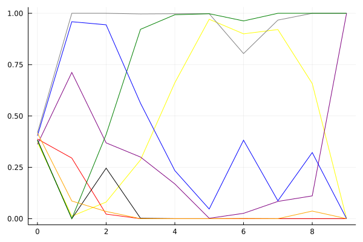

KRPL 2021 시즌 1 32강 A조

## 경기 결과

| 트랙 | JGWON | CHOICE | EAGLE | SSEAL | WINKLE | JUST | RUNPILMO | ROXY |
|:---|---:|---:|---:|---:|---:|---:|---:|---:|
| [월드 뉴욕 대질주](../newyork) | 1 | 0 | 4 | 10 | 5 | -1 | 7 | 3 |
| [황금문명 비밀장치의 위협](../jangchi) | 3 | 5 | -1 | 10 | 1 | 7 | 4 | 0 |
| [해적 숨겨진 보물](../haesumbo) | 7 | 0 | -1 | 4 | 5 | 10 | 3 | 1 |
| [WKC 브라질 서킷](../brazil) | 7 | -1 | 0 | 5 | 4 | 10 | 3 | 1 |
| [월드 두바이 다운타운](../dubai) | 10 | -1 | 3 | 5 | 1 | 7 | 4 | 0 |
| [빌리지 붐힐터널](../boomhill) | 4 | 0 | 3 | -1 | 5 | 1 | 7 | 10 |
| [차이나 골목길 대질주](../golmokgil) | 3 | 0 | -1 | 5 | 7 | 10 | 1 | 4 |
| [님프 바다 신전의 비밀](../nymph) | 1 | -1 | 0 | 7 | 3 | 4 | 5 | 10 |
| [노르테유 익스프레스](../noex) | -1 | 1 | 0 | 7 | 10 | 4 | 5 | 3 |
| __total__ |__35__ |__3__ |__7__ |__52__ |__41__ |__52__ |__39__ |__32__ |

## 시뮬레이션

### 1st 확률

x축: 트랙, y축: 확률
1번: 옐로우, 2번: 블랙, 3번: 레드, 4번: 화이트(회색), 5번: 퍼플, 6번: 그린, 7번: 블루, 8번: 오렌지

| 트랙 | JGWON | CHOICE | EAGLE | SSEAL | WINKLE | JUST | RUNPILMO | ROXY |
|:---|---:|---:|---:|---:|---:|---:|---:|---:|
| 초기 | 0.129 | 0.127 | 0.123 | 0.132 | 0.143 | 0.118 | 0.134 | 0.126 |
| 월드 뉴욕 대질주 | 0.000 | 0.000 | 0.000 | 0.863 | 0.014 | 0.000 | 0.130 | 0.000 |
| 황금문명 비밀장치의 위협 | 0.000 | 0.000 | 0.000 | 0.999 | 0.000 | 0.000 | 0.001 | 0.000 |
| 해적 숨겨진 보물 | 0.004 | 0.000 | 0.000 | 0.894 | 0.002 | 0.103 | 0.012 | 0.000 |
| WKC 브라질 서킷 | 0.004 | 0.000 | 0.000 | 0.513 | 0.002 | 0.525 | 0.000 | 0.000 |
| 월드 두바이 다운타운 | 0.092 | 0.000 | 0.000 | 0.386 | 0.000 | 0.565 | 0.001 | 0.000 |
| 빌리지 붐힐터널 | 0.323 | 0.000 | 0.000 | 0.165 | 0.002 | 0.517 | 0.039 | 0.000 |
| 차이나 골목길 대질주 | 0.038 | 0.000 | 0.000 | 0.080 | 0.002 | 0.899 | 0.000 | 0.000 |
| 님프 바다 신전의 비밀 | 0.001 | 0.000 | 0.000 | 0.290 | 0.000 | 0.817 | 0.001 | 0.000 |
| 노르테유 익스프레스 | 0.000 | 0.000 | 0.000 | 1.000 | 0.000 | 1.000 | 0.000 | 0.000 |

### Advance 확률

x축: 트랙, y축: 확률
1번: 옐로우, 2번: 블랙, 3번: 레드, 4번: 화이트(회색), 5번: 퍼플, 6번: 그린, 7번: 블루, 8번: 오렌지

| 트랙 | JGWON | CHOICE | EAGLE | SSEAL | WINKLE | JUST | RUNPILMO | ROXY |
|:---|---:|---:|---:|---:|---:|---:|---:|---:|
| 초기 | 0.376 | 0.374 | 0.394 | 0.391 | 0.420 | 0.387 | 0.387 | 0.385 |
| 월드 뉴욕 대질주 | 0.013 | 0.001 | 0.281 | 1.000 | 0.718 | 0.000 | 0.953 | 0.083 |
| 황금문명 비밀장치의 위협 | 0.105 | 0.234 | 0.021 | 1.000 | 0.388 | 0.376 | 0.948 | 0.026 |
| 해적 숨겨진 보물 | 0.284 | 0.003 | 0.000 | 0.997 | 0.327 | 0.905 | 0.554 | 0.003 |
| WKC 브라질 서킷 | 0.667 | 0.000 | 0.000 | 0.997 | 0.206 | 0.996 | 0.199 | 0.001 |
| 월드 두바이 다운타운 | 0.967 | 0.000 | 0.000 | 0.997 | 0.003 | 0.999 | 0.047 | 0.000 |
| 빌리지 붐힐터널 | 0.911 | 0.000 | 0.000 | 0.799 | 0.043 | 0.953 | 0.357 | 0.001 |
| 차이나 골목길 대질주 | 0.921 | 0.000 | 0.000 | 0.963 | 0.079 | 0.999 | 0.101 | 0.002 |
| 님프 바다 신전의 비밀 | 0.632 | 0.000 | 0.000 | 1.000 | 0.115 | 0.999 | 0.328 | 0.043 |
| 노르테유 익스프레스 | 0.000 | 0.000 | 0.000 | 1.000 | 1.000 | 1.000 | 0.000 | 0.000 |

### Survive 확률

x축: 트랙, y축: 확률
1번: 옐로우, 2번: 블랙, 3번: 레드, 4번: 화이트(회색), 5번: 퍼플, 6번: 그린, 7번: 블루, 8번: 오렌지

| 트랙 | JGWON | CHOICE | EAGLE | SSEAL | WINKLE | JUST | RUNPILMO | ROXY |
|:---|---:|---:|---:|---:|---:|---:|---:|---:|
| 초기 | 0.635 | 0.635 | 0.651 | 0.633 | 0.661 | 0.650 | 0.621 | 0.637 |
| 월드 뉴욕 대질주 | 0.273 | 0.050 | 0.934 | 1.000 | 0.991 | 0.004 | 0.999 | 0.797 |
| 황금문명 비밀장치의 위협 | 0.444 | 0.709 | 0.142 | 1.000 | 0.810 | 0.819 | 0.996 | 0.205 |
| 해적 숨겨진 보물 | 0.953 | 0.082 | 0.002 | 1.000 | 0.957 | 1.000 | 0.989 | 0.045 |
| WKC 브라질 서킷 | 1.000 | 0.001 | 0.001 | 1.000 | 0.992 | 1.000 | 0.997 | 0.015 |
| 월드 두바이 다운타운 | 1.000 | 0.000 | 0.000 | 1.000 | 0.999 | 1.000 | 1.000 | 0.003 |
| 빌리지 붐힐터널 | 1.000 | 0.000 | 0.001 | 1.000 | 0.928 | 1.000 | 0.996 | 0.095 |
| 차이나 골목길 대질주 | 1.000 | 0.000 | 0.000 | 1.000 | 0.992 | 1.000 | 0.986 | 0.032 |
| 님프 바다 신전의 비밀 | 0.994 | 0.000 | 0.000 | 1.000 | 0.764 | 1.000 | 0.963 | 0.391 |
| 노르테유 익스프레스 | 1.000 | 0.000 | 0.000 | 1.000 | 1.000 | 1.000 | 1.000 | 0.000 |

## 랭킹 변동

### [전체 랭킹](../singles-full)

| 순위 | 변동 | 이름 | 점수 | 변동 | mu | 변동 | sigma | 변동 |
|---:|---:|:---:|---:|---:|---:|---:|---:|---:|
| 1 / 8 | NaN | [JUST](../JUST) | 2826 | +2826 | 3478 | +478 | 217 | -783 |
| 2 / 8 | NaN | [SSEAL](../SSEAL) | 2739 | +2739 | 3384 | +384 | 215 | -785 |
| 3 / 8 | NaN | [WINKLE](../WINKLE) | 2667 | +2667 | 3277 | +277 | 203 | -797 |
| 4 / 8 | NaN | [RUNPILMO](../RUNPILMO) | 2584 | +2584 | 3189 | +189 | 202 | -798 |
| 5 / 8 | NaN | [JGWON](../JGWON) | 2458 | +2458 | 3077 | +77 | 206 | -794 |
| 6 / 8 | NaN | [ROXY](../ROXY) | 2406 | +2406 | 3026 | +26 | 207 | -793 |
| 7 / 8 | NaN | [EAGLE](../EAGLE) | 1726 | +1726 | 2379 | -621 | 218 | -782 |
| 8 / 8 | NaN | [CHOICE](../CHOICE) | 1607 | +1607 | 2271 | -729 | 221 | -779 |

### 시즌 랭킹

| 순위 | 변동 | 이름 | 점수 | 변동 | mu | 변동 | sigma | 변동 |
|---:|---:|:---:|---:|---:|---:|---:|---:|---:|
| 1 / 8 | NaN | [JUST](../JUST) | 2826 | +2826 | 3478 | +478 | 217 | -783 |
| 2 / 8 | NaN | [SSEAL](../SSEAL) | 2739 | +2739 | 3384 | +384 | 215 | -785 |
| 3 / 8 | NaN | [WINKLE](../WINKLE) | 2667 | +2667 | 3277 | +277 | 203 | -797 |
| 4 / 8 | NaN | [RUNPILMO](../RUNPILMO) | 2584 | +2584 | 3189 | +189 | 202 | -798 |
| 5 / 8 | NaN | [JGWON](../JGWON) | 2458 | +2458 | 3077 | +77 | 206 | -794 |
| 6 / 8 | NaN | [ROXY](../ROXY) | 2406 | +2406 | 3026 | +26 | 207 | -793 |
| 7 / 8 | NaN | [EAGLE](../EAGLE) | 1726 | +1726 | 2379 | -621 | 218 | -782 |
| 8 / 8 | NaN | [CHOICE](../CHOICE) | 1607 | +1607 | 2271 | -729 | 221 | -779 |

### 트랙 별 랭킹

#### [WKC 브라질 서킷](../brazil)

| 순위 | 변동 | 이름 | 점수 | 변동 | mu | 변동 | sigma | 변동 |
|:---:|:---:|:---:|---:|---:|---:|---:|---:|---:|
| 1 / 8 | NaN | [JUST](../JUST) | 2161 | +2161 | 4274 | +1274 | 704 | -296 |
| 2 / 8 | NaN | [JGWON](../JGWON) | 1887 | +1887 | 3763 | +763 | 625 | -375 |
| 3 / 8 | NaN | [SSEAL](../SSEAL) | 1622 | +1622 | 3423 | +423 | 600 | -400 |
| 4 / 8 | NaN | [WINKLE](../WINKLE) | 1363 | +1363 | 3137 | +137 | 591 | -409 |
| 5 / 8 | NaN | [RUNPILMO](../RUNPILMO) | 1090 | +1090 | 2863 | -137 | 591 | -409 |
| 6 / 8 | NaN | [ROXY](../ROXY) | 776 | +776 | 2577 | -423 | 600 | -400 |
| 7 / 8 | NaN | [EAGLE](../EAGLE) | 361 | +361 | 2237 | -763 | 625 | -375 |
| 8 / 8 | NaN | [CHOICE](../CHOICE) | -388 | -388 | 1726 | -1274 | 704 | -296 |

#### [노르테유 익스프레스](../noex)

| 순위 | 변동 | 이름 | 점수 | 변동 | mu | 변동 | sigma | 변동 |
|:---:|:---:|:---:|---:|---:|---:|---:|---:|---:|
| 1 / 8 | NaN | [WINKLE](../WINKLE) | 2161 | +2161 | 4274 | +1274 | 704 | -296 |
| 2 / 8 | NaN | [SSEAL](../SSEAL) | 1887 | +1887 | 3763 | +763 | 625 | -375 |
| 3 / 8 | NaN | [RUNPILMO](../RUNPILMO) | 1622 | +1622 | 3423 | +423 | 600 | -400 |
| 4 / 8 | NaN | [JUST](../JUST) | 1363 | +1363 | 3137 | +137 | 591 | -409 |
| 5 / 8 | NaN | [ROXY](../ROXY) | 1090 | +1090 | 2863 | -137 | 591 | -409 |
| 6 / 8 | NaN | [CHOICE](../CHOICE) | 776 | +776 | 2577 | -423 | 600 | -400 |
| 7 / 8 | NaN | [EAGLE](../EAGLE) | 361 | +361 | 2237 | -763 | 625 | -375 |
| 8 / 8 | NaN | [JGWON](../JGWON) | -388 | -388 | 1726 | -1274 | 704 | -296 |

#### [님프 바다 신전의 비밀](../nymph)

| 순위 | 변동 | 이름 | 점수 | 변동 | mu | 변동 | sigma | 변동 |
|:---:|:---:|:---:|---:|---:|---:|---:|---:|---:|
| 1 / 8 | NaN | [ROXY](../ROXY) | 2161 | +2161 | 4274 | +1274 | 704 | -296 |
| 2 / 8 | NaN | [SSEAL](../SSEAL) | 1887 | +1887 | 3763 | +763 | 625 | -375 |
| 3 / 8 | NaN | [RUNPILMO](../RUNPILMO) | 1622 | +1622 | 3423 | +423 | 600 | -400 |
| 4 / 8 | NaN | [JUST](../JUST) | 1363 | +1363 | 3137 | +137 | 591 | -409 |
| 5 / 8 | NaN | [WINKLE](../WINKLE) | 1090 | +1090 | 2863 | -137 | 591 | -409 |
| 6 / 8 | NaN | [JGWON](../JGWON) | 776 | +776 | 2577 | -423 | 600 | -400 |
| 7 / 8 | NaN | [EAGLE](../EAGLE) | 361 | +361 | 2237 | -763 | 625 | -375 |
| 8 / 8 | NaN | [CHOICE](../CHOICE) | -388 | -388 | 1726 | -1274 | 704 | -296 |

#### [빌리지 붐힐터널](../boomhill)

| 순위 | 변동 | 이름 | 점수 | 변동 | mu | 변동 | sigma | 변동 |
|:---:|:---:|:---:|---:|---:|---:|---:|---:|---:|
| 1 / 8 | NaN | [ROXY](../ROXY) | 2161 | +2161 | 4274 | +1274 | 704 | -296 |
| 2 / 8 | NaN | [RUNPILMO](../RUNPILMO) | 1887 | +1887 | 3763 | +763 | 625 | -375 |
| 3 / 8 | NaN | [WINKLE](../WINKLE) | 1622 | +1622 | 3423 | +423 | 600 | -400 |
| 4 / 8 | NaN | [JGWON](../JGWON) | 1363 | +1363 | 3137 | +137 | 591 | -409 |
| 5 / 8 | NaN | [EAGLE](../EAGLE) | 1090 | +1090 | 2863 | -137 | 591 | -409 |
| 6 / 8 | NaN | [JUST](../JUST) | 776 | +776 | 2577 | -423 | 600 | -400 |
| 7 / 8 | NaN | [CHOICE](../CHOICE) | 361 | +361 | 2237 | -763 | 625 | -375 |
| 8 / 8 | NaN | [SSEAL](../SSEAL) | -388 | -388 | 1726 | -1274 | 704 | -296 |

#### [월드 뉴욕 대질주](../newyork)

| 순위 | 변동 | 이름 | 점수 | 변동 | mu | 변동 | sigma | 변동 |
|:---:|:---:|:---:|---:|---:|---:|---:|---:|---:|
| 1 / 8 | NaN | [SSEAL](../SSEAL) | 2161 | +2161 | 4274 | +1274 | 704 | -296 |
| 2 / 8 | NaN | [RUNPILMO](../RUNPILMO) | 1887 | +1887 | 3763 | +763 | 625 | -375 |
| 3 / 8 | NaN | [WINKLE](../WINKLE) | 1622 | +1622 | 3423 | +423 | 600 | -400 |
| 4 / 8 | NaN | [EAGLE](../EAGLE) | 1363 | +1363 | 3137 | +137 | 591 | -409 |
| 5 / 8 | NaN | [ROXY](../ROXY) | 1090 | +1090 | 2863 | -137 | 591 | -409 |
| 6 / 8 | NaN | [JGWON](../JGWON) | 776 | +776 | 2577 | -423 | 600 | -400 |
| 7 / 8 | NaN | [CHOICE](../CHOICE) | 361 | +361 | 2237 | -763 | 625 | -375 |
| 8 / 8 | NaN | [JUST](../JUST) | -388 | -388 | 1726 | -1274 | 704 | -296 |

#### [월드 두바이 다운타운](../dubai)

| 순위 | 변동 | 이름 | 점수 | 변동 | mu | 변동 | sigma | 변동 |
|:---:|:---:|:---:|---:|---:|---:|---:|---:|---:|
| 1 / 8 | NaN | [JGWON](../JGWON) | 2161 | +2161 | 4274 | +1274 | 704 | -296 |
| 2 / 8 | NaN | [JUST](../JUST) | 1887 | +1887 | 3763 | +763 | 625 | -375 |
| 3 / 8 | NaN | [SSEAL](../SSEAL) | 1622 | +1622 | 3423 | +423 | 600 | -400 |
| 4 / 8 | NaN | [RUNPILMO](../RUNPILMO) | 1363 | +1363 | 3137 | +137 | 591 | -409 |
| 5 / 8 | NaN | [EAGLE](../EAGLE) | 1090 | +1090 | 2863 | -137 | 591 | -409 |
| 6 / 8 | NaN | [WINKLE](../WINKLE) | 776 | +776 | 2577 | -423 | 600 | -400 |
| 7 / 8 | NaN | [ROXY](../ROXY) | 361 | +361 | 2237 | -763 | 625 | -375 |
| 8 / 8 | NaN | [CHOICE](../CHOICE) | -388 | -388 | 1726 | -1274 | 704 | -296 |

#### [차이나 골목길 대질주](../golmokgil)

| 순위 | 변동 | 이름 | 점수 | 변동 | mu | 변동 | sigma | 변동 |
|:---:|:---:|:---:|---:|---:|---:|---:|---:|---:|
| 1 / 8 | NaN | [JUST](../JUST) | 2161 | +2161 | 4274 | +1274 | 704 | -296 |
| 2 / 8 | NaN | [WINKLE](../WINKLE) | 1887 | +1887 | 3763 | +763 | 625 | -375 |
| 3 / 8 | NaN | [SSEAL](../SSEAL) | 1622 | +1622 | 3423 | +423 | 600 | -400 |
| 4 / 8 | NaN | [ROXY](../ROXY) | 1363 | +1363 | 3137 | +137 | 591 | -409 |
| 5 / 8 | NaN | [JGWON](../JGWON) | 1090 | +1090 | 2863 | -137 | 591 | -409 |
| 6 / 8 | NaN | [RUNPILMO](../RUNPILMO) | 776 | +776 | 2577 | -423 | 600 | -400 |
| 7 / 8 | NaN | [CHOICE](../CHOICE) | 361 | +361 | 2237 | -763 | 625 | -375 |
| 8 / 8 | NaN | [EAGLE](../EAGLE) | -388 | -388 | 1726 | -1274 | 704 | -296 |

#### [해적 숨겨진 보물](../haesumbo)

| 순위 | 변동 | 이름 | 점수 | 변동 | mu | 변동 | sigma | 변동 |
|:---:|:---:|:---:|---:|---:|---:|---:|---:|---:|
| 1 / 8 | NaN | [JUST](../JUST) | 2161 | +2161 | 4274 | +1274 | 704 | -296 |
| 2 / 8 | NaN | [JGWON](../JGWON) | 1887 | +1887 | 3763 | +763 | 625 | -375 |
| 3 / 8 | NaN | [WINKLE](../WINKLE) | 1622 | +1622 | 3423 | +423 | 600 | -400 |
| 4 / 8 | NaN | [SSEAL](../SSEAL) | 1363 | +1363 | 3137 | +137 | 591 | -409 |
| 5 / 8 | NaN | [RUNPILMO](../RUNPILMO) | 1090 | +1090 | 2863 | -137 | 591 | -409 |
| 6 / 8 | NaN | [ROXY](../ROXY) | 776 | +776 | 2577 | -423 | 600 | -400 |
| 7 / 8 | NaN | [CHOICE](../CHOICE) | 361 | +361 | 2237 | -763 | 625 | -375 |
| 8 / 8 | NaN | [EAGLE](../EAGLE) | -388 | -388 | 1726 | -1274 | 704 | -296 |

#### [황금문명 비밀장치의 위협](../jangchi)

| 순위 | 변동 | 이름 | 점수 | 변동 | mu | 변동 | sigma | 변동 |
|:---:|:---:|:---:|---:|---:|---:|---:|---:|---:|
| 1 / 8 | NaN | [SSEAL](../SSEAL) | 2161 | +2161 | 4274 | +1274 | 704 | -296 |
| 2 / 8 | NaN | [JUST](../JUST) | 1887 | +1887 | 3763 | +763 | 625 | -375 |
| 3 / 8 | NaN | [CHOICE](../CHOICE) | 1622 | +1622 | 3423 | +423 | 600 | -400 |
| 4 / 8 | NaN | [RUNPILMO](../RUNPILMO) | 1363 | +1363 | 3137 | +137 | 591 | -409 |
| 5 / 8 | NaN | [JGWON](../JGWON) | 1090 | +1090 | 2863 | -137 | 591 | -409 |
| 6 / 8 | NaN | [WINKLE](../WINKLE) | 776 | +776 | 2577 | -423 | 600 | -400 |
| 7 / 8 | NaN | [ROXY](../ROXY) | 361 | +361 | 2237 | -763 | 625 | -375 |
| 8 / 8 | NaN | [EAGLE](../EAGLE) | -388 | -388 | 1726 | -1274 | 704 | -296 |
