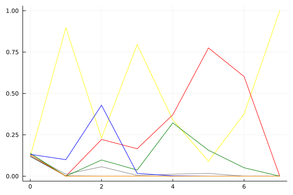
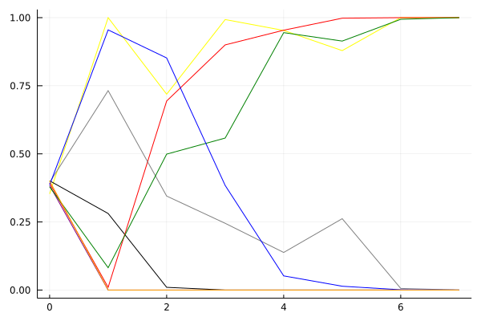
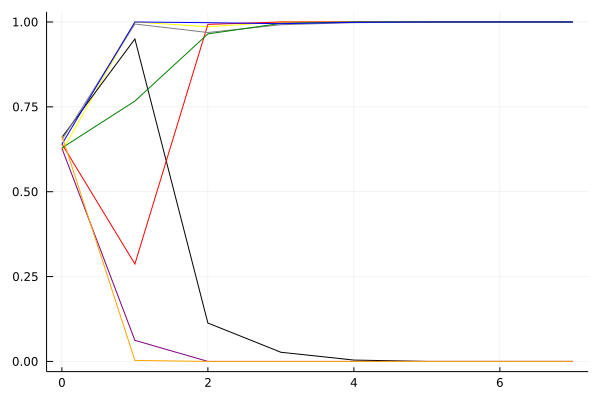

KRPL 2021 시즌 1 32강 B조

## 경기 결과

| 트랙 | JAMES | W4NG | RAMGONG | DANGNI | MERIT | ABSOL | SUNGHYUK | HANDPON |
|:---|---:|---:|---:|---:|---:|---:|---:|---:|
| [월드 뉴욕 대질주](../newyork) | 10 | 4 | 1 | 5 | 0 | 3 | 7 | -1 |
| [해적 숨겨진 보물](../haesumbo) | 3 | 1 | 10 | 4 | -1 | 7 | 5 | 0 |
| [대저택 은밀한 지하실](../daeeunji) | 10 | 1 | 7 | 4 | -1 | 5 | 3 | 0 |
| [포레스트 지그재그](../zigzag) | 4 | 1 | 7 | 5 | -1 | 10 | 3 | 0 |
| [노르테유 익스프레스](../noex) | 4 | 1 | 10 | 7 | -1 | 5 | 3 | 0 |
| [공동묘지 마왕의 초대](../mawang) | 10 | 3 | 7 | 0 | 4 | 5 | 1 | -5 |
| [차이나 골목길 대질주](../golmokgil) | 10 | 1 | 5 | 7 | -1 | 0 | 3 | 4 |
| __total__ |__51__ |__12__ |__47__ |__32__ |__-1__ |__35__ |__25__ |__-2__ |

## 시뮬레이션

### 1st 확률

x축: 트랙, y축: 확률
1번: 옐로우, 2번: 블랙, 3번: 레드, 4번: 화이트(회색), 5번: 퍼플, 6번: 그린, 7번: 블루, 8번: 오렌지

| 트랙 | JAMES | W4NG | RAMGONG | DANGNI | MERIT | ABSOL | SUNGHYUK | HANDPON |
|:---|---:|---:|---:|---:|---:|---:|---:|---:|
| 초기 | 0.119 | 0.120 | 0.129 | 0.128 | 0.130 | 0.139 | 0.132 | 0.129 |
| 월드 뉴욕 대질주 | 0.897 | 0.001 | 0.000 | 0.012 | 0.000 | 0.000 | 0.100 | 0.000 |
| 해적 숨겨진 보물 | 0.231 | 0.000 | 0.222 | 0.057 | 0.000 | 0.098 | 0.429 | 0.000 |
| 대저택 은밀한 지하실 | 0.795 | 0.000 | 0.166 | 0.005 | 0.000 | 0.037 | 0.017 | 0.000 |
| 포레스트 지그재그 | 0.341 | 0.000 | 0.371 | 0.012 | 0.000 | 0.322 | 0.002 | 0.000 |
| 노르테유 익스프레스 | 0.090 | 0.000 | 0.775 | 0.017 | 0.000 | 0.157 | 0.000 | 0.000 |
| 공동묘지 마왕의 초대 | 0.376 | 0.000 | 0.602 | 0.000 | 0.000 | 0.051 | 0.000 | 0.000 |
| 차이나 골목길 대질주 | 1.000 | 0.000 | 0.000 | 0.000 | 0.000 | 0.000 | 0.000 | 0.000 |

### Advance 확률

x축: 트랙, y축: 확률
1번: 옐로우, 2번: 블랙, 3번: 레드, 4번: 화이트(회색), 5번: 퍼플, 6번: 그린, 7번: 블루, 8번: 오렌지

| 트랙 | JAMES | W4NG | RAMGONG | DANGNI | MERIT | ABSOL | SUNGHYUK | HANDPON |
|:---|---:|---:|---:|---:|---:|---:|---:|---:|
| 초기 | 0.353 | 0.401 | 0.393 | 0.395 | 0.384 | 0.379 | 0.386 | 0.401 |
| 월드 뉴욕 대질주 | 1.000 | 0.281 | 0.010 | 0.732 | 0.000 | 0.082 | 0.955 | 0.000 |
| 해적 숨겨진 보물 | 0.719 | 0.010 | 0.694 | 0.345 | 0.000 | 0.499 | 0.852 | 0.000 |
| 대저택 은밀한 지하실 | 0.993 | 0.000 | 0.900 | 0.245 | 0.000 | 0.558 | 0.384 | 0.000 |
| 포레스트 지그재그 | 0.953 | 0.000 | 0.954 | 0.138 | 0.000 | 0.945 | 0.052 | 0.000 |
| 노르테유 익스프레스 | 0.879 | 0.000 | 0.998 | 0.262 | 0.000 | 0.914 | 0.014 | 0.000 |
| 공동묘지 마왕의 초대 | 1.000 | 0.000 | 1.000 | 0.006 | 0.000 | 0.994 | 0.001 | 0.000 |
| 차이나 골목길 대질주 | 1.000 | 0.000 | 1.000 | 0.000 | 0.000 | 1.000 | 0.000 | 0.000 |

### Survive 확률

x축: 트랙, y축: 확률
1번: 옐로우, 2번: 블랙, 3번: 레드, 4번: 화이트(회색), 5번: 퍼플, 6번: 그린, 7번: 블루, 8번: 오렌지

| 트랙 | JAMES | W4NG | RAMGONG | DANGNI | MERIT | ABSOL | SUNGHYUK | HANDPON |
|:---|---:|---:|---:|---:|---:|---:|---:|---:|
| 초기 | 0.619 | 0.660 | 0.641 | 0.653 | 0.628 | 0.629 | 0.640 | 0.665 |
| 월드 뉴욕 대질주 | 1.000 | 0.950 | 0.287 | 0.994 | 0.062 | 0.767 | 1.000 | 0.003 |
| 해적 숨겨진 보물 | 0.986 | 0.113 | 0.993 | 0.969 | 0.000 | 0.965 | 0.998 | 0.000 |
| 대저택 은밀한 지하실 | 1.000 | 0.027 | 1.000 | 0.992 | 0.000 | 0.996 | 0.995 | 0.000 |
| 포레스트 지그재그 | 1.000 | 0.004 | 1.000 | 0.998 | 0.000 | 1.000 | 0.999 | 0.000 |
| 노르테유 익스프레스 | 1.000 | 0.000 | 1.000 | 1.000 | 0.000 | 1.000 | 1.000 | 0.000 |
| 공동묘지 마왕의 초대 | 1.000 | 0.000 | 1.000 | 1.000 | 0.000 | 1.000 | 1.000 | 0.000 |
| 차이나 골목길 대질주 | 1.000 | 0.000 | 1.000 | 1.000 | 0.000 | 1.000 | 1.000 | 0.000 |

## 랭킹 변동

### [전체 랭킹](../singles-full)

| 순위 | 변동 | 이름 | 점수 | 변동 | mu | 변동 | sigma | 변동 |
|---:|---:|:---:|---:|---:|---:|---:|---:|---:|
| 1 / 16 | NaN | [JAMES](../JAMES) | 3075 | +3075 | 3854 | +854 | 260 | -740 |
| 2 / 16 | NaN | [RAMGONG](../RAMGONG) | 3058 | +3058 | 3806 | +806 | 250 | -750 |
| 6 / 16 | NaN | [ABSOL](../ABSOL) | 2665 | +2665 | 3389 | +389 | 241 | -759 |
| 7 / 16 | NaN | [DANGNI](../DANGNI) | 2664 | +2664 | 3373 | +373 | 236 | -764 |
| 11 / 16 | NaN | [SUNGHYUK](../SUNGHYUK) | 2275 | +2275 | 2984 | -16 | 236 | -764 |
| 12 / 16 | NaN | [W4NG](../W4NG) | 1903 | +1903 | 2637 | -363 | 245 | -755 |
| 15 / 16 | NaN | [HANDPON](../HANDPON) | 1303 | +1303 | 2152 | -848 | 283 | -717 |
| 16 / 16 | NaN | [MERIT](../MERIT) | 859 | +859 | 1785 | -1215 | 309 | -691 |

### 시즌 랭킹

| 순위 | 변동 | 이름 | 점수 | 변동 | mu | 변동 | sigma | 변동 |
|---:|---:|:---:|---:|---:|---:|---:|---:|---:|
| 1 / 16 | NaN | [JAMES](../JAMES) | 3075 | +3075 | 3854 | +854 | 260 | -740 |
| 2 / 16 | NaN | [RAMGONG](../RAMGONG) | 3058 | +3058 | 3806 | +806 | 250 | -750 |
| 6 / 16 | NaN | [ABSOL](../ABSOL) | 2665 | +2665 | 3389 | +389 | 241 | -759 |
| 7 / 16 | NaN | [DANGNI](../DANGNI) | 2664 | +2664 | 3373 | +373 | 236 | -764 |
| 11 / 16 | NaN | [SUNGHYUK](../SUNGHYUK) | 2275 | +2275 | 2984 | -16 | 236 | -764 |
| 12 / 16 | NaN | [W4NG](../W4NG) | 1903 | +1903 | 2637 | -363 | 245 | -755 |
| 15 / 16 | NaN | [HANDPON](../HANDPON) | 1303 | +1303 | 2152 | -848 | 283 | -717 |
| 16 / 16 | NaN | [MERIT](../MERIT) | 859 | +859 | 1785 | -1215 | 309 | -691 |

### 트랙 별 랭킹

#### [공동묘지 마왕의 초대](../mawang)

| 순위 | 변동 | 이름 | 점수 | 변동 | mu | 변동 | sigma | 변동 |
|:---:|:---:|:---:|---:|---:|---:|---:|---:|---:|
| 1 / 8 | NaN | [JAMES](../JAMES) | 2161 | +2161 | 4274 | +1274 | 704 | -296 |
| 2 / 8 | NaN | [RAMGONG](../RAMGONG) | 1887 | +1887 | 3763 | +763 | 625 | -375 |
| 3 / 8 | NaN | [ABSOL](../ABSOL) | 1622 | +1622 | 3423 | +423 | 600 | -400 |
| 4 / 8 | NaN | [MERIT](../MERIT) | 1363 | +1363 | 3137 | +137 | 591 | -409 |
| 5 / 8 | NaN | [W4NG](../W4NG) | 1090 | +1090 | 2863 | -137 | 591 | -409 |
| 6 / 8 | NaN | [SUNGHYUK](../SUNGHYUK) | 776 | +776 | 2577 | -423 | 600 | -400 |
| 7 / 8 | NaN | [DANGNI](../DANGNI) | 361 | +361 | 2237 | -763 | 625 | -375 |
| 8 / 8 | NaN | [HANDPON](../HANDPON) | -388 | -388 | 1726 | -1274 | 704 | -296 |

#### [노르테유 익스프레스](../noex)

| 순위 | 변동 | 이름 | 점수 | 변동 | mu | 변동 | sigma | 변동 |
|:---:|:---:|:---:|---:|---:|---:|---:|---:|---:|
| 2 / 16 | NaN | [RAMGONG](../RAMGONG) | 2161 | +2161 | 4274 | +1274 | 704 | -296 |
| 3 / 16 | NaN | [DANGNI](../DANGNI) | 1887 | +1887 | 3763 | +763 | 625 | -375 |
| 6 / 16 | NaN | [ABSOL](../ABSOL) | 1622 | +1622 | 3423 | +423 | 600 | -400 |
| 8 / 16 | NaN | [JAMES](../JAMES) | 1363 | +1363 | 3137 | +137 | 591 | -409 |
| 9 / 16 | NaN | [SUNGHYUK](../SUNGHYUK) | 1090 | +1090 | 2863 | -137 | 591 | -409 |
| 11 / 16 | NaN | [W4NG](../W4NG) | 776 | +776 | 2577 | -423 | 600 | -400 |
| 13 / 16 | NaN | [HANDPON](../HANDPON) | 361 | +361 | 2237 | -763 | 625 | -375 |
| 16 / 16 | NaN | [MERIT](../MERIT) | -388 | -388 | 1726 | -1274 | 704 | -296 |

#### [대저택 은밀한 지하실](../daeeunji)

| 순위 | 변동 | 이름 | 점수 | 변동 | mu | 변동 | sigma | 변동 |
|:---:|:---:|:---:|---:|---:|---:|---:|---:|---:|
| 1 / 8 | NaN | [JAMES](../JAMES) | 2161 | +2161 | 4274 | +1274 | 704 | -296 |
| 2 / 8 | NaN | [RAMGONG](../RAMGONG) | 1887 | +1887 | 3763 | +763 | 625 | -375 |
| 3 / 8 | NaN | [ABSOL](../ABSOL) | 1622 | +1622 | 3423 | +423 | 600 | -400 |
| 4 / 8 | NaN | [DANGNI](../DANGNI) | 1363 | +1363 | 3137 | +137 | 591 | -409 |
| 5 / 8 | NaN | [SUNGHYUK](../SUNGHYUK) | 1090 | +1090 | 2863 | -137 | 591 | -409 |
| 6 / 8 | NaN | [W4NG](../W4NG) | 776 | +776 | 2577 | -423 | 600 | -400 |
| 7 / 8 | NaN | [HANDPON](../HANDPON) | 361 | +361 | 2237 | -763 | 625 | -375 |
| 8 / 8 | NaN | [MERIT](../MERIT) | -388 | -388 | 1726 | -1274 | 704 | -296 |

#### [월드 뉴욕 대질주](../newyork)

| 순위 | 변동 | 이름 | 점수 | 변동 | mu | 변동 | sigma | 변동 |
|:---:|:---:|:---:|---:|---:|---:|---:|---:|---:|
| 2 / 16 | NaN | [JAMES](../JAMES) | 2161 | +2161 | 4274 | +1274 | 704 | -296 |
| 3 / 16 | NaN | [SUNGHYUK](../SUNGHYUK) | 1887 | +1887 | 3763 | +763 | 625 | -375 |
| 5 / 16 | NaN | [DANGNI](../DANGNI) | 1622 | +1622 | 3423 | +423 | 600 | -400 |
| 7 / 16 | NaN | [W4NG](../W4NG) | 1363 | +1363 | 3137 | +137 | 591 | -409 |
| 10 / 16 | NaN | [ABSOL](../ABSOL) | 1090 | +1090 | 2863 | -137 | 591 | -409 |
| 12 / 16 | NaN | [RAMGONG](../RAMGONG) | 776 | +776 | 2577 | -423 | 600 | -400 |
| 13 / 16 | NaN | [MERIT](../MERIT) | 361 | +361 | 2237 | -763 | 625 | -375 |
| 15 / 16 | NaN | [HANDPON](../HANDPON) | -388 | -388 | 1726 | -1274 | 704 | -296 |

#### [차이나 골목길 대질주](../golmokgil)

| 순위 | 변동 | 이름 | 점수 | 변동 | mu | 변동 | sigma | 변동 |
|:---:|:---:|:---:|---:|---:|---:|---:|---:|---:|
| 2 / 16 | NaN | [JAMES](../JAMES) | 2161 | +2161 | 4274 | +1274 | 704 | -296 |
| 3 / 16 | NaN | [DANGNI](../DANGNI) | 1887 | +1887 | 3763 | +763 | 625 | -375 |
| 6 / 16 | NaN | [RAMGONG](../RAMGONG) | 1622 | +1622 | 3423 | +423 | 600 | -400 |
| 7 / 16 | NaN | [HANDPON](../HANDPON) | 1363 | +1363 | 3137 | +137 | 591 | -409 |
| 9 / 16 | NaN | [SUNGHYUK](../SUNGHYUK) | 1090 | +1090 | 2863 | -137 | 591 | -409 |
| 12 / 16 | NaN | [W4NG](../W4NG) | 776 | +776 | 2577 | -423 | 600 | -400 |
| 14 / 16 | NaN | [ABSOL](../ABSOL) | 361 | +361 | 2237 | -763 | 625 | -375 |
| 15 / 16 | NaN | [MERIT](../MERIT) | -388 | -388 | 1726 | -1274 | 704 | -296 |

#### [포레스트 지그재그](../zigzag)

| 순위 | 변동 | 이름 | 점수 | 변동 | mu | 변동 | sigma | 변동 |
|:---:|:---:|:---:|---:|---:|---:|---:|---:|---:|
| 1 / 8 | NaN | [ABSOL](../ABSOL) | 2161 | +2161 | 4274 | +1274 | 704 | -296 |
| 2 / 8 | NaN | [RAMGONG](../RAMGONG) | 1887 | +1887 | 3763 | +763 | 625 | -375 |
| 3 / 8 | NaN | [DANGNI](../DANGNI) | 1622 | +1622 | 3423 | +423 | 600 | -400 |
| 4 / 8 | NaN | [JAMES](../JAMES) | 1363 | +1363 | 3137 | +137 | 591 | -409 |
| 5 / 8 | NaN | [SUNGHYUK](../SUNGHYUK) | 1090 | +1090 | 2863 | -137 | 591 | -409 |
| 6 / 8 | NaN | [W4NG](../W4NG) | 776 | +776 | 2577 | -423 | 600 | -400 |
| 7 / 8 | NaN | [HANDPON](../HANDPON) | 361 | +361 | 2237 | -763 | 625 | -375 |
| 8 / 8 | NaN | [MERIT](../MERIT) | -388 | -388 | 1726 | -1274 | 704 | -296 |

#### [해적 숨겨진 보물](../haesumbo)

| 순위 | 변동 | 이름 | 점수 | 변동 | mu | 변동 | sigma | 변동 |
|:---:|:---:|:---:|---:|---:|---:|---:|---:|---:|
| 2 / 16 | NaN | [RAMGONG](../RAMGONG) | 2161 | +2161 | 4274 | +1274 | 704 | -296 |
| 4 / 16 | NaN | [ABSOL](../ABSOL) | 1887 | +1887 | 3763 | +763 | 625 | -375 |
| 5 / 16 | NaN | [SUNGHYUK](../SUNGHYUK) | 1622 | +1622 | 3423 | +423 | 600 | -400 |
| 7 / 16 | NaN | [DANGNI](../DANGNI) | 1363 | +1363 | 3137 | +137 | 591 | -409 |
| 9 / 16 | NaN | [JAMES](../JAMES) | 1090 | +1090 | 2863 | -137 | 591 | -409 |
| 12 / 16 | NaN | [W4NG](../W4NG) | 776 | +776 | 2577 | -423 | 600 | -400 |
| 13 / 16 | NaN | [HANDPON](../HANDPON) | 361 | +361 | 2237 | -763 | 625 | -375 |
| 15 / 16 | NaN | [MERIT](../MERIT) | -388 | -388 | 1726 | -1274 | 704 | -296 |
